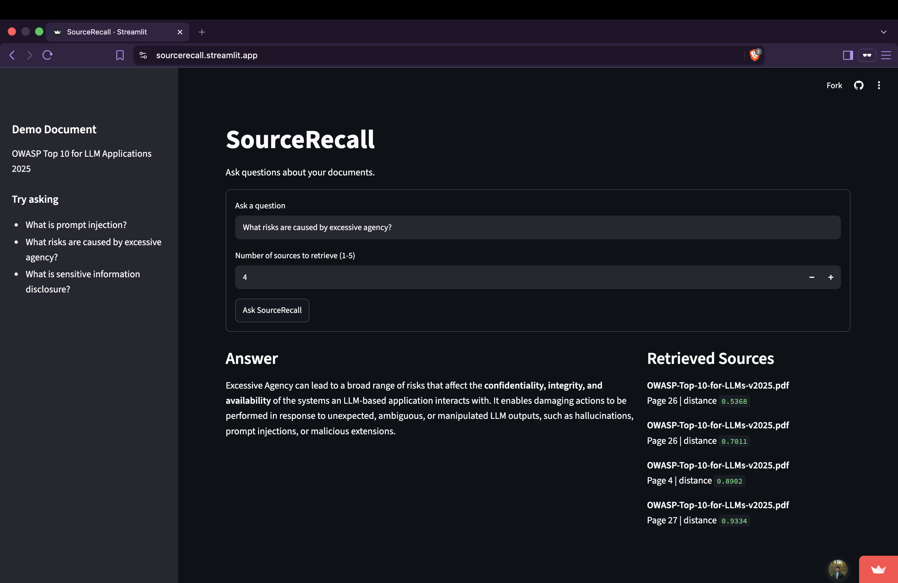

# SourceRecall

SourceRecall is a retrieval-augmented generation system for querying notes, technical documents, and research PDFs with source-grounded answers and page-level retrieval provenance.

It was built from the ground up to understand the individual components of a practical RAG pipeline rather than hiding retrieval behind a high-level framework.

### [Try the live SourceRecall demo](https://source-recall.streamlit.app/)



## Overview

SourceRecall takes a user question, retrieves semantically relevant chunks from indexed documents, and provides those chunks to an LLM as grounded context.

The system supports text, Markdown, and PDF documents. PDF ingestion preserves page-level provenance so retrieved information can be traced back to the document and page it came from.

The public demo uses the **OWASP Top 10 for LLM Applications 2025** as a curated technical document and displays both the generated answer and metadata for the retrieved sources.

## Why I Built This

I built SourceRecall to understand how retrieval-augmented generation systems work beyond simple chatbot demos.

Instead of sending a question directly to an LLM, SourceRecall implements the pipeline around the model:

```txt
document ingestion
→ PDF text extraction
→ chunking
→ embeddings
→ vector storage
→ semantic retrieval
→ prompt construction
→ grounded generation
→ retrieval evaluation
```

I intentionally avoided using a high-level RAG framework so I could understand how data moves through each stage, how metadata should be preserved, how retrieval quality can be measured, and where retrieval systems can fail.

## Features

- Load `.pdf`, `.md`, and `.txt` documents
- Extract PDF text page-by-page with page-level provenance
- Split documents into overlapping text chunks
- Generate embeddings using Sentence Transformers
- Store chunks, embeddings, and metadata in ChromaDB
- Preserve source, page, and chunk metadata through retrieval
- Retrieve semantically relevant chunks for natural-language queries
- Configure the number of retrieved chunks from the Streamlit interface
- Generate grounded answers through Groq
- Retain an Ollama generation function for local experimentation
- Display retrieved filenames, page numbers, and vector distances
- Automatically initialize the vector store when a collection does not exist
- Evaluate retrieval independently from generation using a manually labeled benchmark
- Calculate Hit@1, Hit@3, and Hit@5 automatically
- Run through either a CLI workflow or interactive Streamlit interface
- Deploy as a public web application

## Tech Stack

- Python
- Streamlit
- ChromaDB
- Sentence Transformers
- `all-MiniLM-L6-v2`
- Groq
- Ollama
- pypdf
- Vector search
- Retrieval-Augmented Generation

## Architecture

```txt
                   ┌─────────────────────┐
                   │    User Question    │
                   └──────────┬──────────┘
                              │
                              ▼
                   ┌─────────────────────┐
                   │   Query Embedding   │
                   │ SentenceTransformer │
                   └──────────┬──────────┘
                              │
                              ▼
                   ┌─────────────────────┐
                   │ ChromaDB Retrieval  │
                   └──────────┬──────────┘
                              │
                    Top-k relevant chunks
                              │
                              ▼
                   ┌─────────────────────┐
                   │ Prompt Construction │
                   │ Source + Page Meta  │
                   └──────────┬──────────┘
                              │
                              ▼
                   ┌─────────────────────┐
                   │  Groq Generation    │
                   └──────────┬──────────┘
                              │
                              ▼
             ┌─────────────────────────────────┐
             │ Grounded Answer + Source Pages  │
             └─────────────────────────────────┘
```

An Ollama generation function is also retained in the codebase for local experimentation, but the current CLI and Streamlit interfaces use Groq.

## Project Structure

```txt
source-recall/
├── assets/
│   └── sourcerecall-demo.png
├── data/
│   ├── demo/
│   │   └── OWASP-Top-10-for-LLMs-v2025.pdf
│   └── raw/
├── eval/
│   └── retrieval_questions.json
├── src/
│   ├── app.py
│   ├── ingest.py
│   ├── chunk.py
│   ├── embed.py
│   ├── store.py
│   ├── retrieve.py
│   ├── generate.py
│   └── pipeline.py
├── requirements.txt
├── .env.example
├── .gitignore
└── README.md
```

The `outputs/` directory is generated locally when retrieval evaluation is run.

## How It Works

### 1. Document Ingestion

SourceRecall loads supported documents from the configured data directory.

Text and Markdown files are read directly. PDFs are processed page-by-page with `pypdf`, preserving the source path and page number as metadata.

### 2. Chunking

Extracted text is split into overlapping character-based chunks.

The current baseline uses:

- 700-character chunks
- 100-character overlap

Each chunk retains metadata identifying its source document, page number, and chunk position.

### 3. Embeddings

Chunks are embedded using:

```txt
all-MiniLM-L6-v2
```

The same embedding model is used for incoming user queries.

### 4. Vector Storage

Chunks, embeddings, and metadata are stored in a persistent ChromaDB collection.

If the application starts and the SourceRecall collection does not exist, the vector store is automatically built from the configured data directory.

Automatic initialization does not synchronize an existing collection with later document changes.

### 5. Retrieval

When a user asks a question, SourceRecall embeds the query and searches ChromaDB for the closest matching chunks.

The Streamlit interface allows the user to retrieve between 1 and 5 chunks.

### 6. Grounded Generation

Retrieved chunks are assembled into a prompt that instructs the model to answer using only the provided context.

Each context block includes its source path and page number.

The current CLI and public Streamlit application use a hosted model through Groq. This allows the deployed application to operate without depending on a personal Ollama server or development machine.

An Ollama generation function remains available in the codebase for local experimentation, but there is currently no user-facing provider selector.

### 7. Retrieval Provenance

The Streamlit interface displays metadata for the retrieved chunks alongside the generated answer:

- source filename
- PDF page number
- vector distance

This allows users to identify which documents and pages were retrieved for a query.

The current interface does not display the full retrieved passages and does not generate inline citations inside the answer.

## Public Demo

The deployed application is available at:

**https://source-recall.streamlit.app/**

The public demo currently indexes:

**OWASP Top 10 for LLM Applications 2025**

Example questions include:

- What is prompt injection?
- What risks are caused by excessive agency?
- What is sensitive information disclosure?
- How can prompt injection attacks be mitigated?

The OWASP document is a curated demonstration dataset. SourceRecall itself is domain-agnostic and can operate on other supported document collections.

## Data Handling

The current CLI and public Streamlit application use Groq for hosted LLM generation.

When a user submits a question:

1. SourceRecall embeds the question and performs retrieval against the ChromaDB collection.
2. The retrieved chunks are assembled into the generation prompt.
3. The user's question and retrieved document text are sent to Groq for answer generation.

This means that running the current Streamlit or CLI interface locally does **not** make generation fully local.

An Ollama generation function exists for local experimentation, but using it currently requires changing the generation path in code.

API credentials are loaded through environment variables and are not stored in the repository.

## Local Setup

Create and activate a virtual environment:

```bash
python3 -m venv .venv
source .venv/bin/activate
```

Install dependencies:

```bash
pip install -r requirements.txt
```

Copy the environment template:

```bash
cp .env.example .env
```

Configure the environment:

```env
GROQ_API_KEY=your_key_here
DATA_FOLDER=data/demo
```

The real `.env` file is intentionally excluded from version control.

## Running the Streamlit App

Start SourceRecall with:

```bash
streamlit run src/app.py
```

If the ChromaDB collection does not exist, SourceRecall automatically builds it from the configured data directory.

SourceRecall does not currently detect when indexed files are added, removed, or modified. It also does not automatically rebuild an existing collection when `DATA_FOLDER` changes.

After changing the indexed document collection, rebuild manually:

```bash
python src/pipeline.py build
```

The build command deletes the existing SourceRecall collection and creates a new one from the currently configured data directory.

## CLI Usage

Build the vector store:

```bash
python src/pipeline.py build
```

Ask a question:

```bash
python src/pipeline.py ask "What is prompt injection?"
```

Run retrieval evaluation:

```bash
python src/pipeline.py eval
```

Evaluation results are written to:

```txt
outputs/retrieval_eval.json
```

The evaluator automatically creates the `outputs/` directory if necessary.

## Retrieval Evaluation

Generation quality can hide poor retrieval, so SourceRecall evaluates the retriever independently from the LLM.

The benchmark contains **25 manually written questions** based on a technical research PDF used during development.

Each benchmark question includes:

- an expected source document
- an expected PDF page

For every query, SourceRecall retrieves the five highest-ranking chunks.

A retrieval counts as a hit only when both the expected source and expected page appear within the evaluated rank cutoff.

Retrieval performance is measured using page-level Hit@k:

- **Hit@1** — expected source and page appear as the highest-ranked result
- **Hit@3** — expected source and page appear within the top three results
- **Hit@5** — expected source and page appear within the top five results

### Benchmark Dataset

The retrieval benchmark is separate from the OWASP document used by the public demo.

The reported baseline was produced using a single technical research PDF and the 25 questions stored in:

```txt
eval/retrieval_questions.json
```

The benchmark PDF itself is not distributed with this repository.

The original benchmark configuration used the source referenced by the `expected_source` values in the evaluation file. To reproduce the original experiment, the same benchmark document must be available at the expected location, or the expected source labels must be updated to match the local path.

The public OWASP demo collection should not be used to reproduce the benchmark results.

Once the benchmark document is configured, run:

```bash
python src/pipeline.py build
python src/pipeline.py eval
```

The evaluator calculates the metrics automatically and writes both the aggregate summary and per-question results to:

```txt
outputs/retrieval_eval.json
```

### Baseline Results

| Metric | Hits | Result |
| --- | ---: | ---: |
| Hit@1 | 12 / 25 | **48%** |
| Hit@3 | 20 / 25 | **80%** |
| Hit@5 | 23 / 25 | **92%** |

These results were reproduced programmatically using the current evaluator after adding source-and-page matching.

The baseline uses:

- character-based chunking
- 700-character chunks
- 100-character overlap
- `all-MiniLM-L6-v2` embeddings
- ChromaDB vector retrieval
- top-5 retrieval

This benchmark evaluates retrieval within a single technical PDF and is intended to establish a reproducible experimental baseline within that benchmark setup rather than claim general retrieval performance across arbitrary document collections.

### Observed Failure Mode

One notable failure mode occurred with bibliography and reference pages.

Reference sections contain dense concentrations of terminology related to a document's subject, which can make them appear semantically similar to a query even when they are not the most useful source for answering it.

This provided a measurable failure case for future retrieval experiments involving:

- chunking strategies
- embedding models
- metadata filtering
- reranking
- hybrid retrieval

## Current Limitations

- Chunking is character-based and can divide useful semantic context across chunk boundaries.
- PDF chunks are bounded by extracted page contents, so information spanning pages may be separated.
- Vector retrieval always returns the nearest chunks even when none are strongly relevant.
- Multiple chunks from the same page can appear among the top results.
- Bibliography and reference sections can rank highly for topic-related queries.
- Vector distance is useful for debugging but should not be treated directly as a user-facing confidence score.
- The current interface shows retrieval metadata but not the full retrieved chunk text.
- Generated answers do not currently contain inline source citations.
- Scanned or image-only PDFs are not supported because SourceRecall does not perform OCR.
- Existing indexes are not automatically synchronized when documents change.
- The current CLI and Streamlit interfaces use hosted generation through Groq.
- Retrieval is not a replacement for structured analysis when tasks require reliable calculations across an entire dataset.

## Future Work

Potential future improvements include:

- semantic or section-aware chunking
- expanded multi-document retrieval evaluation
- retrieval-result inspection tools
- duplicate-page handling in the interface
- configurable embedding models
- reranking
- hybrid lexical and vector retrieval
- document collection management
- automatic index synchronization
- user-selectable generation providers
- PostgreSQL with `pgvector`
- structured extraction for aggregation and analytical tasks

These improvements are intentionally outside the current version so the existing baseline and deployed application can remain stable.

## What I Learned

Building SourceRecall reinforced that RAG is not simply an LLM with documents attached to it.

A useful RAG system depends on the entire pipeline around the model: ingestion, preprocessing, chunking, embeddings, metadata, vector storage, retrieval, prompt construction, generation, and evaluation.

Adding PDF support showed me why provenance matters. Retrieving the correct document is useful, but retaining the source and page number makes retrieval substantially easier to inspect and verify.

Building a retrieval benchmark showed me that plausible generated answers do not necessarily imply strong retrieval. Evaluating the retriever separately made it possible to identify failures, quantify performance, and determine whether later retrieval changes actually improve the system.

The benchmark also exposed a concrete retrieval failure mode: semantically dense bibliography sections can rank highly despite not containing the most useful answer context.

Finally, deploying SourceRecall forced the system to operate beyond my local development environment. The public application automatically initializes its vector store from a curated dataset and uses hosted generation, allowing the demo to run independently of my local Ollama instance and personal hardware.

## Status

### SourceRecall v2 — Complete

SourceRecall v2 includes:

- `.txt`, `.md`, and `.pdf` ingestion
- page-aware PDF provenance
- Sentence Transformer embeddings
- ChromaDB vector retrieval
- source-and-page retrieval evaluation
- automatic Hit@1, Hit@3, and Hit@5 scoring
- Streamlit web interface
- hosted Groq generation
- retained Ollama generation function for local experimentation
- automatic vector-store initialization when a collection does not exist
- public deployment

**Live demo:** https://source-recall.streamlit.app/

Current retrieval baseline:

- Hit@1: **48%**
- Hit@3: **80%**
- Hit@5: **92%**
